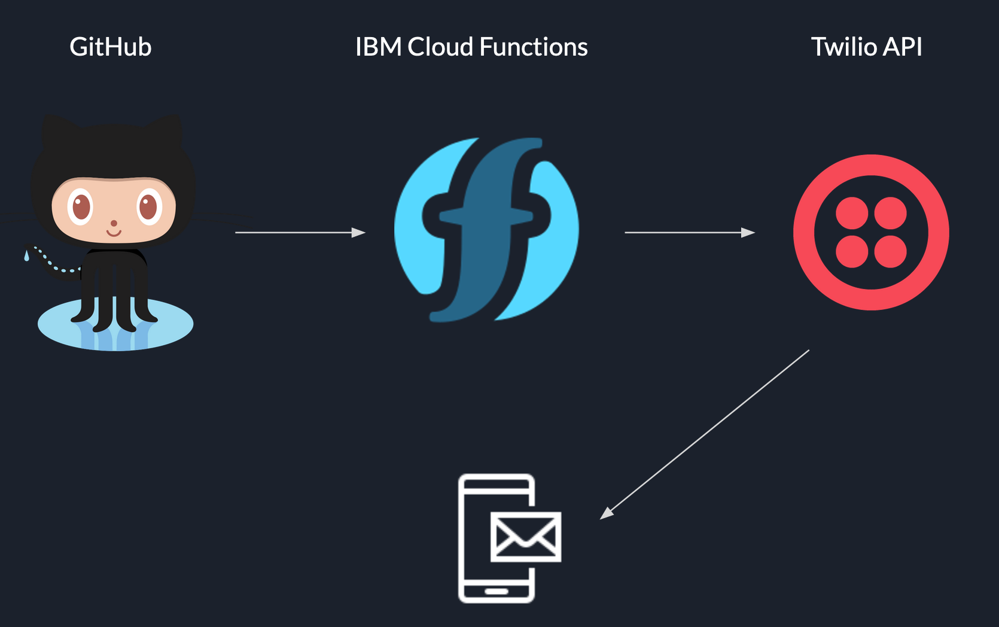

# cloud-functions-twilio-notifications
Learn how to create serverless functions and enable them to be triggered based on external events.

In this workshop we use:

1. IBM Cloud Functions
2. Twilio
3. GitHub Webhooks

## Prerequisites

1. An IBM Cloud account
2. A GitHub account

---

- [Create a GitHub repository]
- [Set up Twilio]
- [Create IBM Cloud Function]

[Create a GitHub repository]: ./workshop-instructions/setup-github-repository.md
[Set up Twilio]: ./workshop-instructions/setup-twilio.md
[Create IBM Cloud Function]: ./workshop-instructions/setup-ibm-cloud-function.md

