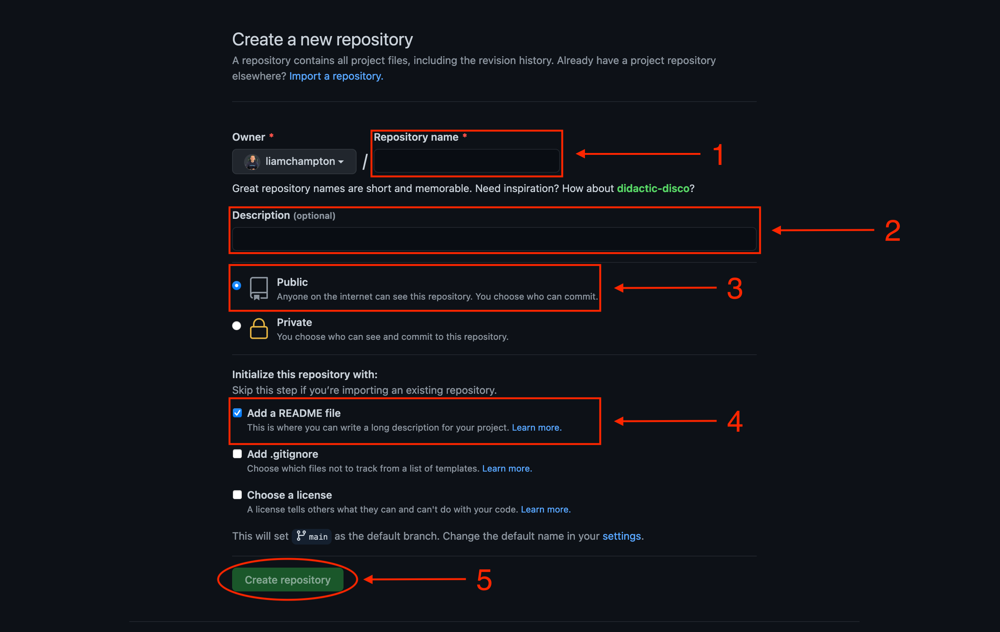
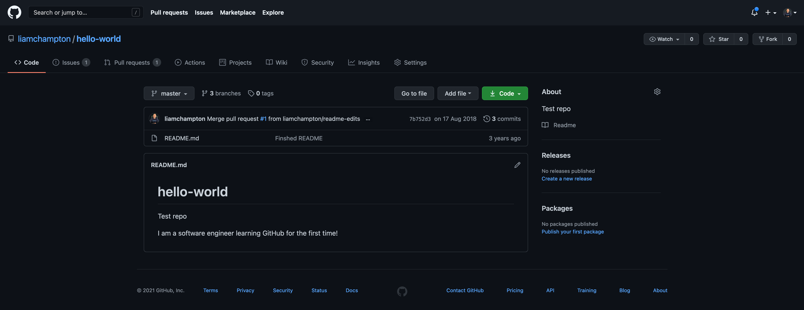

# Create a GitHub test repository

GitHub is the perfect place for storing code. It works seamlessly with its counterpart version control tool `git`. In a nut shell, it allows multiple people or teams to work on the same project at the same time without tripping over each other. It provides developers with the tools to store code remotely without the need to save and package up from a local machine every time you make a change.

For this workshop, everything will be done in the browser but it is a good idea to have both a [GitHub account]() and [git]() installed on your local machine.

## Step 1 - Login or Sign up to GitHub

If you do not already have an account, you will need to sign up. Don't worry, it is free.

If you do have an account, log in.

Once you are logged in, navigate to your profile page

## Step 2 - Crete a new repository

Click on the `+` in the top right of your screen and select `New Repository`.

1. Give it a unique name
2. Git it a description example - "A repository to test a IBM Cloud Functions and Webhooks"
3. Ensure it is a public repository - this will eliminate any repository access complications
4. Add a `README.md` as this will be the file you make your change to.

You will end up with a very empty and bland repository, similar to the one shown below, but for the purpose of this workshop, this is all you will need!

