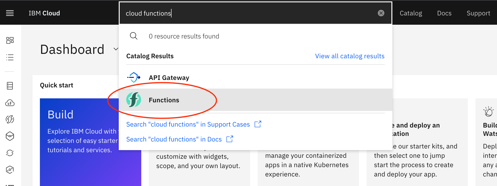
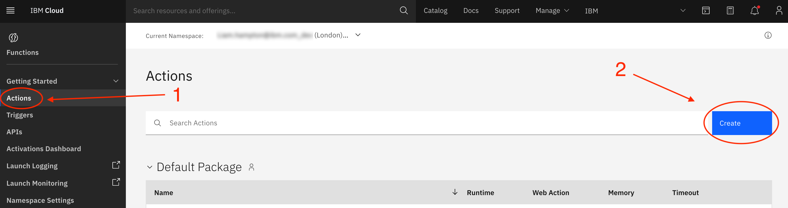
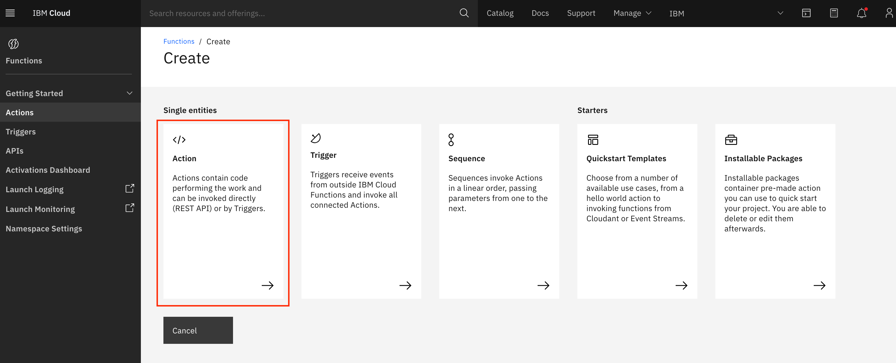
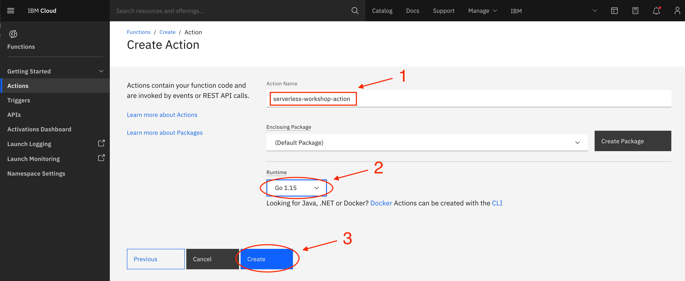
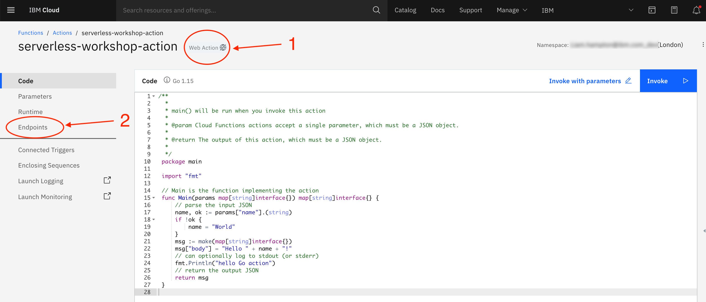
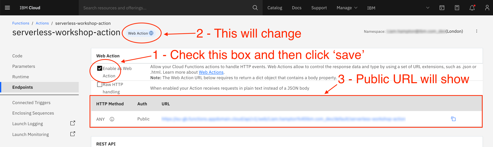

# Create an IBM Cloud Function

## Step 1 - Sign Up or Login to IBM Cloud

[Login or Sing Up]() to IBM Cloud

## Step 2 - Create a Cloud Functions Action

Once logged in, in the top search bar enter `cloud functions` and select the option with the `f` symbol.

This will take you to the Functions dashboard. Select `Actions` from the side bar.

Here you will have 5 single entities to choose from. Select `Action`.

Give the `Action` a name and select the Runtime. There is no need to change the package so this can be left as `(Default Package)`. For the purpose of this workshop I have chosen `Go`. Feel free to mix it up and choose a language you are most familiar with. The principals of this workshop are very much the same across the board.

## Step 3 - Set up the Action

As it stands this Action is not public and this prevents Webhooks and other public HTTP actions from interacting with it. To change this you need to make it a `Web Action`. Select `Endpoints` from the side bar.

Select the checkbox `Enable as Web Action` and click `Save`. You will notice the `Web Action` icon change and you will be able to see the pub HTTP URL.

