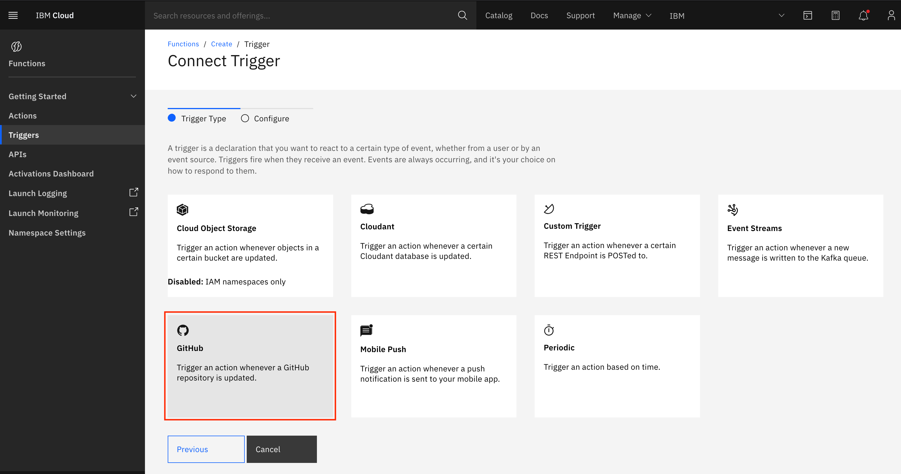

# Create an IBM Cloud Function

## Step 1 - Sign Up or Login to IBM Cloud

[Login or Sing Up]() to IBM Cloud

## Step 2 - Create a Cloud Functions Action

Once logged in, in the top search bar enter `cloud functions` and select the option with the `f` symbol.


This will take you to the Functions dashboard. Select `Actions` from the side bar.


Here you will have 5 single entities to choose from. Select `Action`.


Give the `Action` a name and select the Runtime. There is no need to change the package so this can be left as `(Default Package)`. For the purpose of this workshop I have chosen `Go`. Feel free to mix it up and choose a language you are most familiar with. The principals of this workshop are very much the same across the board.


## Step 3 - Set up the Action

As it stands this Action is not public and this prevents Webhooks and other public HTTP actions from interacting with it. To change this you need to make it a `Web Action`. Select `Endpoints` from the side bar.


Select the checkbox `Enable as Web Action` and click `Save`. You will notice the `Web Action` icon change and you will be able to see the pub HTTP URL.


Now the `Action` is public and we can hit the endpoint from external sources, we need to set up some parameters for the code to use. This is essentially an environment variable for the function.

For this, you will need to add the following:

`recipientNumber` = The number you wish to send a text message too

`authToken` = Your Twilio Account Auth Token (Found on your dashboard)

`accountSid` = Your Twilio Account SID (Found on your dashboard)

`twilioNumber` = Your number associated with your Twilio Account


## Step 4 - Create the function code

Read the code below line by line to understand what is happening. If you are not using `Go`, then do not panic as this can easily be translated and it's fairly simple to understand. 

```go
package main

import (
	"encoding/json"
	"fmt"
	"net/http"
	"net/url"
	"strings"
)

// Main is the function implementing the action
func Main(params map[string]interface{}) map[string]interface{} {

	action := params["action"].(string)
	twilioNumber := params["twilioNumber"].(string)
	recipientNumber := params["recipientNumber"].(string)

	// only invoke Twilio message service if the GitHub PR action = assigned
	if action == "assigned" {

		fmt.Println("pull request assigned")

		// set account info
		accountSid := params["accountSid"].(string)
		authToken := params["authToken"].(string)
		urlStr := "https://api.twilio.com/2010-04-01/Accounts/" + accountSid + "/Messages.json"

		// text message being sent to recipient
		textMsg := "New pull request assignee"

		// package the data values
		msgData := url.Values{}
		msgData.Set("To", recipientNumber)
		msgData.Set("From", twilioNumber)
		msgData.Set("Body", textMsg)
		msgDataReader := *strings.NewReader(msgData.Encode())

		msg := request(authToken, accountSid, urlStr, msgDataReader)

		return msg
	}

	fmt.Println("Pull request action = ", action)
	msg := make(map[string]interface{})
	msg["action"] = action

	// return the output JSON
	return msg
}

func request(authToken, accountSid, urlStr string, msgDataReader strings.Reader) map[string]interface{} {
	// create HTTP client, req & set req headers
	client := &http.Client{}
	req, _ := http.NewRequest("POST", urlStr, &msgDataReader)
	req.SetBasicAuth(accountSid, authToken)
	req.Header.Add("Accept", "application/json")
	req.Header.Add("Content-Type", "application/x-www-form-urlencoded")

	// HTTP POST request and return message SID to the console
	resp, _ := client.Do(req)
	var msg = make(map[string]interface{})
	if resp.StatusCode >= 200 && resp.StatusCode < 300 {
		var data map[string]interface{}
		decoder := json.NewDecoder(resp.Body)
		err := decoder.Decode(&data)
		if err == nil {
			fmt.Println(data["sid"])
			msg["status"] = "sent"
		}
	} else {
		fmt.Println(resp.Status)
		msg["status"] = "not sent"
	}
	return msg
}
```

## **Have you spotted anything odd in the code?**

`action := params["action"].(string)`

We haven't specified an `action` parameter for our function. The reason we haven't is because this will be within the payload of the `POST` request that hits this endpoint. It is still a parameter, just not one that we need to set.

Let me explain.

When the GitHub Webhook sends a `POST` request to this endpoint, it will carry with it a payload of information. This payload will tell us much more information about the changes being made on GitHub. 

Visit [GitHub Webhook events](https://docs.github.com/en/developers/webhooks-and-events/webhook-events-and-payloads#webhook-payload-object-common-properties) for more information about each event payload.

For this workshop, I am using the [pull_request](https://docs.github.com/en/developers/webhooks-and-events/webhook-events-and-payloads#pull_request) event. You can see here, the `key` is `action` and it can have many values. In the code snippet above, we are making decisions based on the value of `action`.

## Step 4 - Manually test the function

First we will check the function fails correctly. The code to send a text message notification should only run if the value of `action` == `assigned`. All other cases should fail gracefully and just return a message to the console and return an object with the action that was supplied in the parameters.


You should see that the output is what we expected. A simple log to the console of the action and the return object containing the action. No other code was executed as the conditions were not met.


We can see it is now passively failing successfully. Lets see if we can make it pass correctly and send a text message.

To do this, we need to change it parameters we are invoking the Action with. Change `test` to `assigned` and then invoke it again.


The action works! Now what? We need to trigger it.

## Step 5 - Trigger the Action

Before we get started with this step, make sure you have you a GitHub repository you can test on. If you don't, don't panic. Just checkout this [repository tutorial]() which shows you how to create your own. (This only takes ~2 minutes to do).

A `Trigger` is something that will take an event from outside of IBM Cloud Functions and invoke all connected `Actions`.

Head back to the `Functions` dashboard and select `Triggers` on the side panel and click on `Create`.


You will be faced with the same 5 options, much like you were earlier. Select `Trigger`.


This will lead you to a page with a few more options around what type of trigger events we can listen for. For this workshop we are listening to GitHub Webhook events so select `GitHub`.



Setting up the trigger steps:
1. Click on `Get Access Token` - Clicking on this button will promp you to authenticate with GitHub if this is your first time authenticating or it will automatically get the an Auth Token. Either way, this just gived GitHub permission to interact with the `Trigger`.
2. `Trigger Name` is how it will be referenced
3. `Username` - This is your GitHub Username and _should_ populate automatically.
4. `Repository` - This will be the repository with the Webhook attached to it and the repository that you wish to interact with the trigger. Select one from the dropdown list (preferably the one you created to test this workshop on).
5. `Events` - This is a comma seperated list and is GitHub specific. The `Trigger` will only listen for the Events you specify. A full list of Events can be found on the [GitHub Webhook docs](https://docs.github.com/en/actions/reference/events-that-trigger-workflows#webhook-events). For this, enter `pull_request` as this is the event we want to listen for.
6. Click `Create`


Wait for the `Trigger` to create and load.

After it has been created, you will need to connect the `Action` created in the previous steps.


Since we have already made an `Action`, navigate to the `Select Existing` tab and find the `Action` from the dropdown list and click on `Add`.


You can see the Webhook attached to the repository buy looking in the `Settings` of the repository on GitHub.


## Try it out

Head to the testing repository you created and edit the `README.md`


Make a change to the code and then make sure you check the button `Create a new branch for this commit and start a pull request`


This will take you through to opening a new pull request. Give it a title (and a description if you wish) and then click `Create new pull request`.


The final piece to this puzzle is selecting a new assignee. For the purpose of this workshop, you can just assign yourself. This will be enough to create an event and trigger your serverless function.


If everything has been set up correctly, you should:

1. Receive a text from Twilio (this may take a minute).

and

2. Be able to see the logs in the `Activations Dashboard`.


