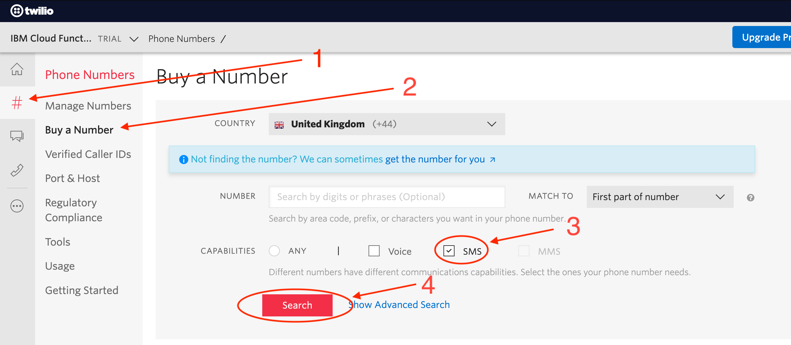
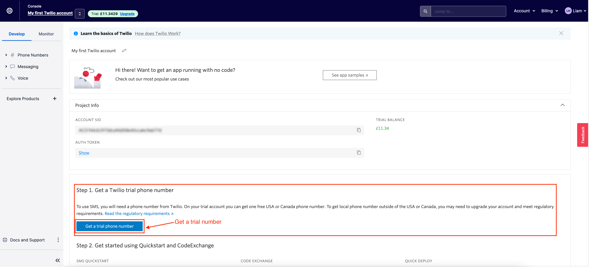

# Create a Twilio Account

This doesn't cost you anything and all you need to do is sign up for a [Twilio](https://www.twilio.com/) trial account that includes $15 credit.

## Step 1 - Sign up
Simple enter your details into the form to sign up

## Step 2 - Buy a number
Once you have logged into your account you will need to set it up.

Buy a number (this will use your trial credit do not panic)

## Step 3 - Check your dashboard

Navigate back to your dashboard and it should look something similar to this:

That is all you needed to do for Twilio but don't close it down just yet. You will need to use the `Account SID` & `Auth Token` shortly!

Let's get coding and create the serverless function! - [IBM Cloud Functions](./setup-ibm-cloud-function.md)