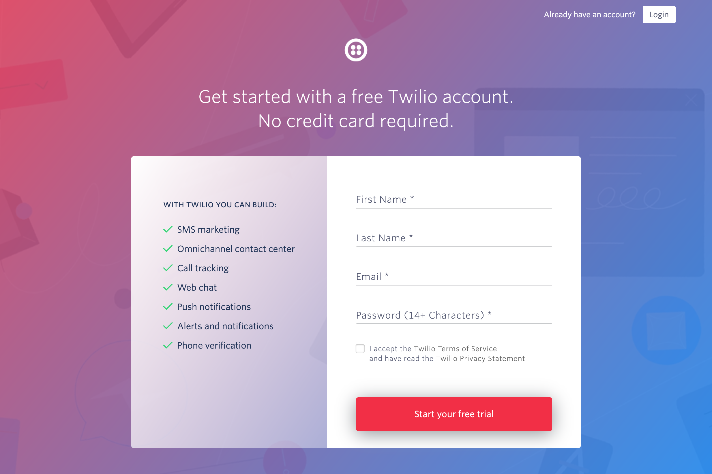
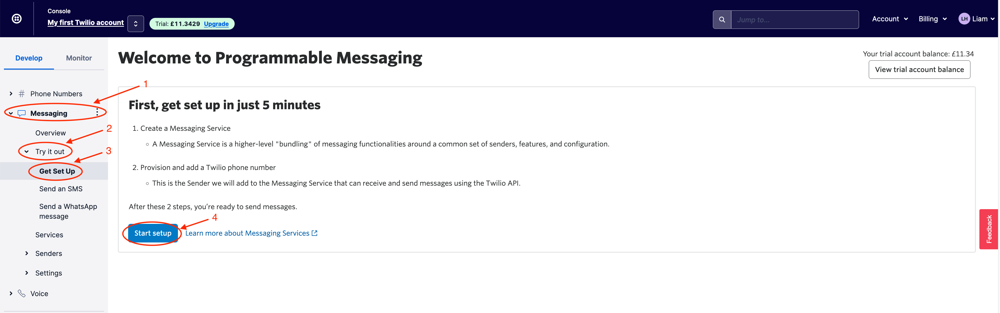

# Create a Twilio Account

In this workshop, the Twilio API is going to be called and used to send a text message to your phone. It doesn't require a credit card to sign up and all you need to do is sign up for a [Twilio trial account](https://www.twilio.com/try-twilio) that includes $15 credit.

## Step 1 - Sign up
Using the link above, head over to Twilio and sign up for the free trial account and enter your details into the form shown. You will also be asked to verify your account with the email link sent to you.

## Step 2 - Buy a number
Once you have set up and logged into your account you will need to set it up.

Navigate to your account dashboard and click the button `Get a trial phone number`.

> :rotating_light: This will use your trial credit so do not panic :rotating_light:

Alternatively, head over to the left side panel and click on the `# Phone Numbers -> Manage -> Buy a number`.

Select your country and tick the box `SMS` as this number only needs to send a text message. 

Click `Search`. You will be given a list of numbers that match the search criteria.

Next, click on the `Buy` button at the end of the row of the number you wish to buy.

> :rotating_light: Please read the warnings provided by Twilio as this might not be free within the trial in every country :rotating_light:

## Step 3 - Check your dashboard

Navigate back to your account dashboard and it should look something similar to image below.

> **Ensure you have a trial number visible**

## Step 4 - Create a programmable messaging service

In order to call the Twilio API and allow your account to send SMS text messages there needs to be a programmable messaging service set up.

To do this, on the left side panel navigate to `Messaging -> Try it out -> Get Set Up`.

Once on this page, click the button `Start setup`.

The next step is to give the service a name. In this example, it is called `Liams-Messaging-Service` but feel free to change it up!

Finally, the last step is to select your trial phone number from the drop-down list. This should be pre-populated if it is the only number you own in your account. This will be the number that outgoing SMS text messages are sent from.

Once the Programmable Messaging Service is created you should see a screen saying "Congratulations! You're all set up." with some information about the service.

Now it is set up, test the service is working correctly - I advise you do this to prevent facing issues later in the workshop.

To do this, click on `Try SMS`.

Once on the page to test the service, ensure your actual phone number is populated in the `To phone number` box.

Next, select your Messaging Service from the dropdown list `From Messaging Service SID`.

Write your text message in the `Body Text` box and then click `Send test SMS`.

You should receive a text message to your phone if this is working correctly! :tada:

That is all you needed to do for Twilio but don't close it down just yet. You will need to use the `Account SID` & `Auth Token` shortly (this is found on your main account dashboard)!

Let's get coding and create the serverless function in IBM Cloud! - [IBM Cloud Functions](./setup-ibm-cloud-function.md)